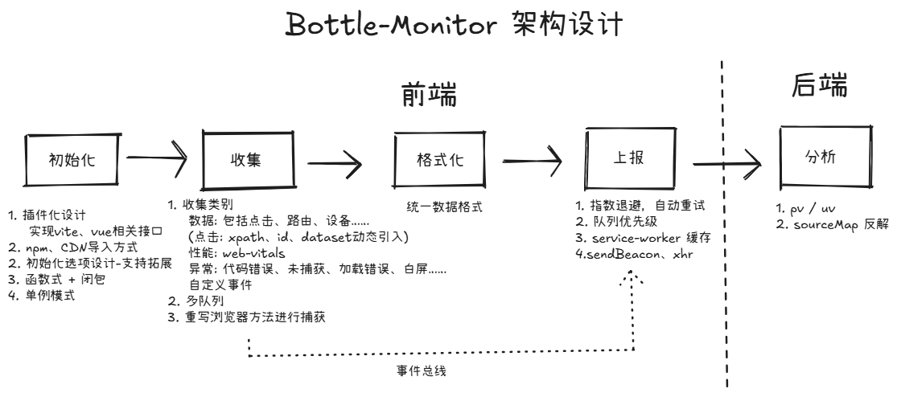

📘 [English](README.md) | 📙 [简体中文](README-zh.md)

# 🍾 Bottle-Monitor
A lightweight, extensible front-end monitoring SDK that supports event tracking, performance monitoring, and error capturing.
Built-in multi-queue reporting ensures a stable and reliable monitoring system for your applications.

## ✨ Features
- **Plugin-based architecture** – Hot-pluggable, compatible with Vue, Vite, and native integration, easily extended for new data types.

- **Multi-queue mechanism** – Separate queues for different event types with configurable priorities.

- **Runtime injection** – No source code modifications required, supports XPath / dataset dynamic tagging.

- **Offline fault tolerance** – Service Worker caching & automatic retries.

- **Multiple reporting channels** – Adaptive sendBeacon / XHR.

- **Unified data formatting** – Reduces backend parsing overhead.

## 📦 Installation
Supports both npm and CDN imports – in development…

## 🏗 Architecture

Bottle-Monitor’s frontend consists of Initialization → Collection → Formatting → Reporting,
while the backend handles data analysis and SourceMap stack trace resolution.

### Frontend Flow
**Initialization** – Plugin-based, supports npm / CDN integration.
Singleton pattern ensures a single global state.

**Collection** –

- Data: Clicks (XPath / ID / dataset), routing changes, device info

- Performance: web-vitals metrics

- Errors: Code exceptions, uncaught errors, resource load failures, white screens

- Custom events

**Data Formatting** – Unified schema for easy backend storage and analysis.

**Reporting** – Exponential backoff, automatic retry, priority queues, Service Worker caching, sendBeacon / XHR fallback.

### Backend Flow
- PV / UV statistics

- SourceMap-based error stack trace resolution