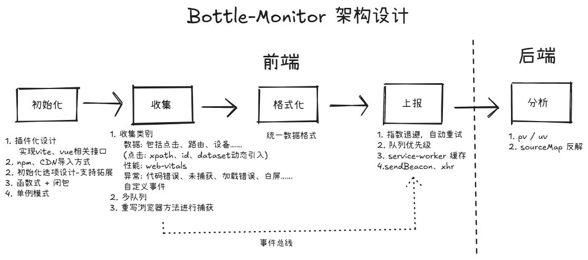

# Bottle Monitor 设计

本页介绍 Bottle Monitor 的架构设计和实现细节。

## 整体架构

[查看大图](./architecture.png)

Bottle Monitor 采用插件化架构，通过事件总线连接核心与插件，实现松耦合的监控系统。整体分为四个核心层次：

- 初始化层 ：单例模式管理实例，插件注册与配置。考虑到污染，抛弃挂载至全局的方案，
- 收集层 ：各类插件负责数据采集（错误、性能、用户行为），通过事件总线传递至传输层队列。
- 存储层 ：多级缓存策略（内存 → localStorage → ServiceWorker）
- 传输层 ：负责数据格式化 + 上报。

## 核心部分
### 1.事件总线 (eventBus)
采用发布-订阅模式连接各个插件，在普通发布订阅的基础上做了一些拓展，主要表现在：

- 限制类型，打造类型安全的事件系统
- 使用泛型工具，进行自动参数类型推导
- 支持异步事件处理
- 支持一次性订阅和取消订阅

### 2.传输系统 (Transport)
传输系统负责数据的格式化、队列管理和上报，功能包括：
- 多队列机制 ：不同事件类型独立队列，支持优先级控制
- 离线容错 ：网络断开时自动缓存，恢复后批量上报
- 智能上报 ：sendBeacon / XHR 自适应选择，设计定时上报 + 队列满后上报双机制
- 数据格式化 ：统一数据结构，减少后端解析压力

### 3.插件管理器 (Tracker)
插件管理器负责插件的注册、初始化和生命周期管理，保存单一的插件示例。

## 插件系统

### User 插件
User 插件负责用户行为数据的采集，包括设备信息、点击事件、路由变化等，主要功能为：
- 事件捕获：重写 history、xhr、fetch 部分方法，进行事件劫持
- 信息收集：收集点击事件、路由变化，方便错误复现，进行 PV/UV、热力图分析

**数据采集类型**：
- 设备信息 (`USER.DEVICE`)：浏览器、操作系统、UA等
- 点击事件 (`USER.CLICK`)：目标元素、位置坐标、页面URL
- 路由变化 (`USER.HISTORY_ROUTE` / `USER.HASH_ROUTE`)：路由跳转记录

**实现原理**：
- 设备信息：基于 `ua-parser-js` 解析 UserAgent
- 点击追踪：全局 `click` 事件监听，记录目标元素信息
- 路由监控：重写 `pushState`/`replaceState`，监听 `popstate`/`hashchange`

### Web Vitals 插件
Web Vitals 插件专注于性能指标的采集，涵盖核心 Web 指标和自定义性能监控，监控指标包括：
- 核心指标 ：FCP、LCP、CLS、FID 和 INP、TTFB
- 自定义指标 ：FSP（First Screen Paint）、FPS、Long Task
- 资源性能 ：缓存命中率、资源加载时间

**核心 Web 指标**
- FCP (First Contentful Paint)：首次内容绘制时间
- LCP (Largest Contentful Paint)：最大内容绘制时间
- CLS (Cumulative Layout Shift)：累积布局偏移
- FID (First Input Delay)：首次输入延迟
- INP (Interaction to Next Paint)：交互到下次绘制
- TTF (Time to First Byte)：首字节时间

**自定义指标**
- FSP (First Screen Paint)：首屏绘制时间
- Long Task：长任务监控（>50ms）
- 资源性能：缓存命中率分析

### Error 插件
Error 插件负责各类异常的捕获和上报，提供全面的错误监控能力，监控类型涵盖代码异常、Promise 异常、资源加载异常。

**异常类型覆盖**
- JavaScript 错误 (`ABNORMAL.CODE`)：运行时异常、语法错误
- Promise 异常 (`ABNORMAL.UNHANDLEDREJECTION`)：未捕获的 Promise 拒绝
- 资源异常 (`ABNORMAL.RESOURCE`)：图片、脚本、样式加载失败
- 白屏检测 (`ABNORMAL.WHITESCREEN`)：页面白屏监控（规划中）

**错误信息增强**
- 堆栈解析：基于 `error-stack-parser` 提供详细堆栈
- 源码定位：记录文件名、行号、列号
- 上下文信息：错误发生时的用户行为轨迹

## 数据流动
1. **插件采集** → 各插件通过 Performance API、事件监听等方式采集原始数据
2. **事件发布** → 插件通过 `eventBus.emit('bottle-monitor:transport', category, data)` 发布数据
3. **数据处理** → Transport 层接收数据，进行格式化和队列管理
4. **上报决策** → 根据队列大小、网络状态、定时器等条件决定上报时机
5. **容错处理** → 上报失败时自动缓存到 localStorage/IndexedDB，支持离线重试

## 设计优势
1.插件化架构 ：模块解耦，易于扩展和维护

2.类型安全 ：全面的 TypeScript 支持

3.性能优化 ：异步处理、队列管理、智能上报

4.容错能力 ：多级缓存、自动重试、离线支持

5.灵活配置 ：丰富的配置选项，支持按需启用功能

6.统一数据格式 ：减少后端解析复杂度

## 存在问题
1.队列设计不合理，考虑设备信息队列应与 user 队列拆开；追踪用户点击又可能会消耗比较大的队列，且不一定会上报。
2.初始化选项设计不够结构化，导致每个插件初始化时需要传入整个初始化选项
3.只能对 bottle-monitor 初始化一次，未细化到选项级别
4.目前插件是一起全部下载的，不知道要不要按插件下载
5.目前插件初始化是写死的，不能拓展
